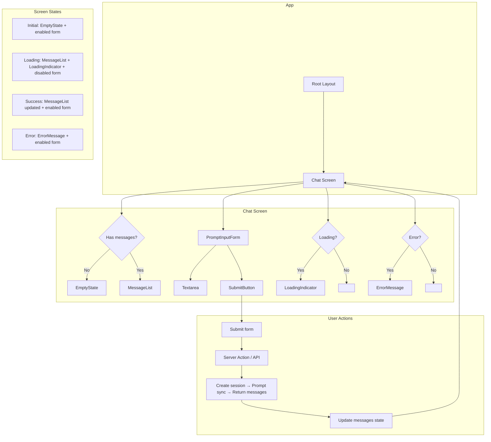
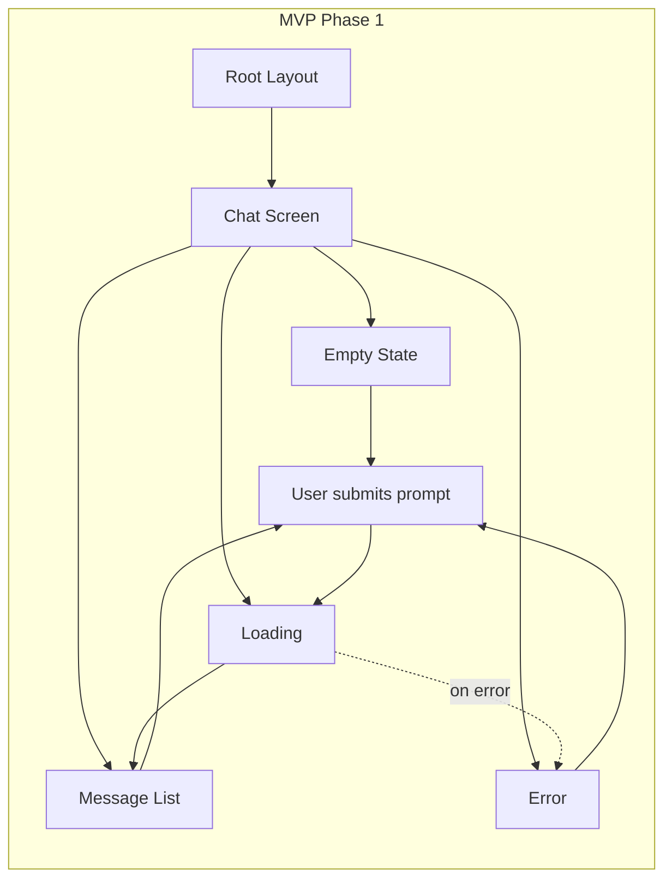

# MVP Phase 1 – Detailed UI Development Plan

## 1. Screen Inventory

| Screen | Route | Purpose |
|--------|-------|---------|
| Root Layout | (wrapper) | App shell, providers, global structure |
| Chat | `/` or `/chat` | Primary MVP screen: user inputs prompt, sees AI response |

**Scope:** One substantive screen (Chat). Root layout wraps all pages. No session list, no settings, no auth screens in MVP.

---

## 2. Root Layout

**File:** `apps/web/app/layout.tsx`

### Structure

- **HTML shell:** `html` with `lang="en"`
- **Body:** Wraps all page content; provides font variables and global providers if needed
- **Children slot:** Renders the active page (e.g. Chat)

### Components

| Component | Role |
|-----------|------|
| `html` | Document root |
| `body` | Main container; receives font class variables |
| `children` | Page content (Chat for MVP) |

### Layout

```
┌─────────────────────────────────────────┐
│ html                                    │
│  ┌───────────────────────────────────┐  │
│  │ body                              │  │
│  │  ┌─────────────────────────────┐  │  │
│  │  │ children (page content)     │  │  │
│  │  └─────────────────────────────┘  │  │
│  └───────────────────────────────────┘  │
└─────────────────────────────────────────┘
```

### Behavior

- No header, footer, or nav in MVP
- Layout remains the same for all routes
- Metadata (title, description) should reflect the app

---

## 3. Chat Screen

**File:** `apps/web/app/page.tsx` (if home is Chat) or `apps/web/app/chat/page.tsx`

### Purpose

User types a prompt, submits, waits for the AI response, and sees the full response. No streaming, no session list.

### Screen Structure

```
┌─────────────────────────────────────────────────────────────┐
│ ChatScreen                                                  │
│                                                             │
│  ┌─────────────────────────────────────────────────────┐   │
│  │ MessageArea (scrollable)                             │   │
│  │   - EmptyState | MessageList                         │   │
│  │   - LoadingIndicator (when loading)                  │   │
│  └─────────────────────────────────────────────────────┘   │
│                                                             │
│  ┌─────────────────────────────────────────────────────┐   │
│  │ PromptInputForm (fixed at bottom)                    │   │
│  │   - Textarea | SubmitButton                          │   │
│  └─────────────────────────────────────────────────────┘   │
│                                                             │
└─────────────────────────────────────────────────────────────┘
```

### Component Hierarchy

```
ChatScreen
├── MessageArea
│   ├── EmptyState (when no messages)
│   ├── MessageList (when messages exist)
│   │   ├── MessageBubble (user)
│   │   └── MessageBubble (assistant)
│   └── LoadingIndicator (when isPending)
├── PromptInputForm
│   ├── Textarea
│   └── SubmitButton
└── ErrorMessage (when error; optional inline)
```

---

## 4. Chat Screen – Component Details

### 4.1 MessageArea

**Role:** Shows messages or an empty state; optionally shows loading.

**Layout:**
- Flex or grid; takes remaining vertical space
- Scrollable when content overflows
- Vertically stacks: EmptyState or MessageList, plus LoadingIndicator when loading

**States:**
- **Empty:** No messages yet → render EmptyState
- **Has messages:** Render MessageList
- **Loading:** Overlay or inline LoadingIndicator; may keep previous messages visible

**Props:**
- `messages: Message[]` – user and assistant messages
- `isLoading: boolean`
- `error: string | null`

---

### 4.2 EmptyState

**Role:** Shown when there are no messages.

**Layout:**
- Centered in MessageArea
- Single block of copy or icon + copy

**Content:**
- Short instruction (e.g. “Enter a prompt below to start.”)
- Optional: simple visual (icon or illustration placeholder)

**Props:** None required; can use static content.

---

### 4.3 MessageList

**Role:** Renders the list of user and assistant messages in order.

**Layout:**
- Vertical stack (column)
- Each message is a MessageBubble
- Newest at bottom; list scrolls to bottom when new message arrives

**Props:**
- `messages: Message[]` – each with `role` (user | assistant) and `content` (string)

**Behavior:**
- Scroll to bottom when messages change
- Order matches API response order

---

### 4.4 MessageBubble

**Role:** One message (user or assistant).

**Layout:**
- Block
- Role-specific alignment: user right, assistant left (or both left with role label)
- Distinct visual treatment per role (handled in implementation)

**Props:**
- `role: "user" | "assistant"`
- `content: string`

**Content:**
- Text only in MVP
- No markdown or tool-call rendering in Phase 1

---

### 4.5 LoadingIndicator

**Role:** Shows that a request is in progress.

**Layout:**
- Inline or overlay within MessageArea
- Appears below last message or in a fixed position
- Simple text or spinner

**Props:**
- `isLoading: boolean` (or rendered conditionally by parent)

**Content:**
- “Thinking…” or similar
- Optional: spinner/animation

---

### 4.6 PromptInputForm

**Role:** Captures user input and submits it to the server.

**Layout:**
- Fixed at bottom of screen (or bottom of content area)
- Row: Textarea + SubmitButton
- Full width; Textarea grows vertically (min/max height) if supported

**Structure:**
```
┌────────────────────────────────────────┬──────────┐
│ Textarea                               │ Submit   │
│ (multiline input)                      │ Button   │
└────────────────────────────────────────┴──────────┘
```

**Behavior:**
- Submit via Enter (with Shift+Enter for newline if desired)
- Disable Submit when text is empty or when loading
- Clear or keep text after submit (recommend: clear on success)
- Use form `action` with server action, or `onSubmit` + `fetch` to API route

**Props:**
- `onSubmit` or form `action` (server action)
- `isDisabled: boolean` (during loading)
- `placeholder: string` (e.g. “Enter your prompt…”)

---

### 4.7 Textarea

**Role:** Multiline text input for the prompt.

**Layout:**
- Flexible width
- Min and max height to avoid too small or too large
- Resize behavior: vertical only or none

**Props:**
- `value` and `onChange` (if controlled) or `name` (if uncontrolled)
- `placeholder`
- `disabled`
- `aria-label` for accessibility

**Constraints:**
- No character limit in MVP (optional: basic max length)

---

### 4.8 SubmitButton

**Role:** Triggers form submission.

**Layout:**
- Placed next to or below Textarea
- Fixed or flexible width

**Props:**
- `disabled` (when empty or loading)
- `children` (e.g. “Send” or “Submit”)

**Behavior:**
- Disabled when form is invalid or request is in progress
- Uses `type="submit"` when inside a form

---

### 4.9 ErrorMessage

**Role:** Displays a non-blocking error (e.g. API failure).

**Layout:**
- Inline above PromptInputForm or within MessageArea
- Dismissible or auto-hide on retry

**Content:**
- Error text from server or generic fallback

**Props:**
- `message: string | null`
- `onDismiss?: () => void`

---

## 5. Chat Screen – States

| State | MessageArea | PromptInputForm |
|-------|-------------|-----------------|
| **Initial (empty)** | EmptyState | Enabled |
| **Loading** | MessageList (previous) + LoadingIndicator | Disabled |
| **Success** | MessageList with new messages | Enabled, input cleared |
| **Error** | MessageList (if any) + ErrorMessage | Enabled |

---

## 6. Data Flow

1. User types in Textarea.
2. User clicks Submit or presses Enter.
3. Form submits → server action or API route.
4. Server: create session → sync prompt → return messages.
5. Client receives messages; updates local state.
6. MessageList re-renders with new messages.
7. MessageArea scrolls to bottom.

**State (client):**
- `messages: Message[]`
- `isPending: boolean` (from `useFormStatus` or manual)
- `error: string | null`

---

## 7. Responsiveness (Layout Only)

- **Desktop:** Two-column layout for input (Textarea + Button) possible; MessageArea uses full width.
- **Mobile:** Stack MessageArea above form; form can be single column (Textarea full width, Button below or beside).

No styling details; structure should support both layouts.

---

## 8. Accessibility (Structure)

- Form has `aria-label` or associated label.
- Textarea has `aria-label` or visible label.
- LoadingIndicator has `aria-live` for screen readers.
- ErrorMessage has `role="alert"` or `aria-live`.
- Submit button has clear label and is keyboard-focusable.

---

## 9. File Structure

```
apps/web/
├── app/
│   ├── layout.tsx          # Root layout
│   ├── page.tsx            # Chat screen (if home = chat)
│   └── globals.css
├── components/
│   └── chat/
│       ├── ChatScreen.tsx       # Container
│       ├── MessageArea.tsx      # Messages + empty + loading
│       ├── EmptyState.tsx
│       ├── MessageList.tsx
│       ├── MessageBubble.tsx
│       ├── LoadingIndicator.tsx
│       ├── PromptInputForm.tsx
│       └── ErrorMessage.tsx
└── ...
```

---

## 10. UI Flow Diagram



---

## 11. Screen Flow (Brief)



**Flow summary:**
1. User lands on Chat Screen (home or `/chat`).
2. Initial view: EmptyState + PromptInputForm.
3. User types prompt and submits.
4. Loading state: LoadingIndicator, form disabled.
5. On success: MessageList shows user + assistant messages; form enabled.
6. User can submit again; messages append.
7. On error: ErrorMessage shown; form enabled for retry.
8. No navigation to other screens in MVP.
